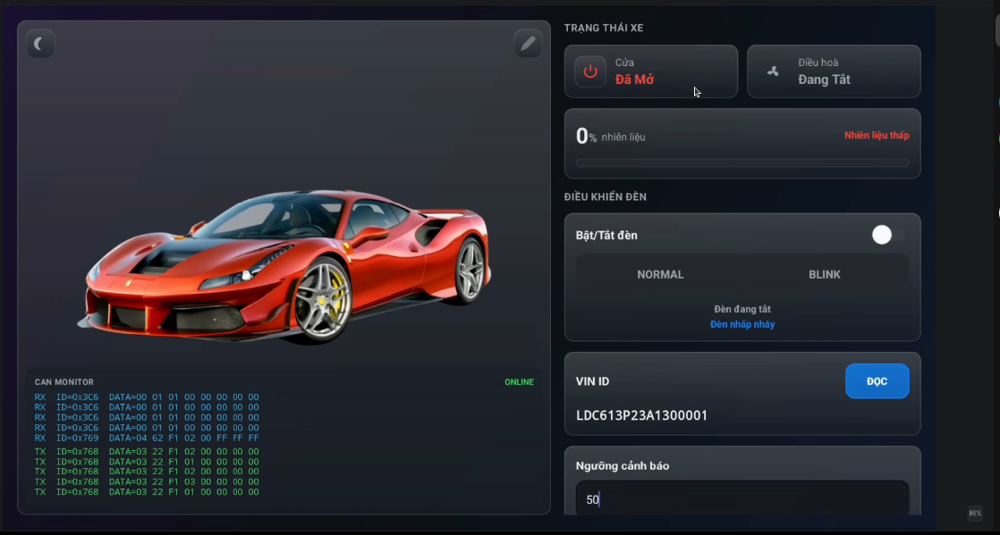

# CANtrolX — Automotive Launcher & CAN Dashboard cho AOSP

CANtrolX là một **ứng dụng Android Automotive đóng vai trò màn hình trung tâm (Home/Launcher) của xe**. Nó hiển thị trạng thái xe theo thời gian thực (đèn, khoá cửa, điều hoà, nhiên liệu) và cho phép điều khiển (bật/tắt đèn, đổi chế độ đèn, ghi ngưỡng cảnh báo nhiên liệu). Dữ liệu không phải giả lập: app nói chuyện với một **ECU thật (NXP S32K144 chạy firmware AUTOSAR)** qua **CAN bus** — đúng cách một head unit trên xe thương mại giao tiếp với các hộp điều khiển.

Điểm đáng chú ý của dự án: nó đi xuyên **đủ 4 tầng của một hệ thống automotive thực tế** — app Android, system service native, kernel (SocketCAN), và ECU nhúng — thay vì chỉ dừng ở một app mô phỏng.

## 1. Bức tranh toàn cảnh

```
┌────────────────────────────────────┐
│  App CANtrolX (Kotlin, MVVM)       │  ui → data (VehicleRepository)
│  chạy như system app trong AOSP    │
└────────────────┬───────────────────┘
                 │ ① Binder (AIDL: hust.can.ICan/default)
┌────────────────▼───────────────────┐
│  CanService (C++ / NDK)            │  hust_service_fixed/
│  đăng ký qua AServiceManager       │  canOpen / canWrite / canRead / canClose
└────────────────┬───────────────────┘
                 │ ② SocketCAN (PF_CAN, SOCK_RAW) — API CAN của kernel Linux
┌────────────────▼───────────────────┐
│  can0 @ 500 kbit/s                 │  cấu hình bằng `ip link`
└────────────────┬───────────────────┘
                 │ ③ CAN bus (2 dây CAN-H/CAN-L)
┌────────────────▼───────────────────┐
│  ECU S32K144 (firmware AUTOSAR)    │  Com: broadcast trạng thái 0x3C6
│  Dcm / CanTp / Com                 │  Dcm: trả lời UDS trên 0x769
└────────────────────────────────────┘
```

Vì sao phải có tầng ②, không cho app mở socket CAN trực tiếp? Android không cho ứng dụng Java/Kotlin mở raw socket kiểu `PF_CAN`; việc đó cần chạy ở tầng native với quyền hệ thống. Do đó ta viết một **service C++ nhỏ chạy từ lúc boot**, mở SocketCAN, rồi **expose 4 hàm qua AIDL/Binder** cho app gọi. Đây cũng chính là mô hình chuẩn của Android Automotive (VHAL — Vehicle HAL) thu nhỏ.

Cũng vì vậy app **phải là system app ký platform key** nằm trong image AOSP: app lấy binder bằng `ServiceManager.getService()` (qua reflection), API này không dành cho app thường cài qua `adb install`.

## 2. Từng thành phần

### 2.1. ECU S32K144 (firmware AUTOSAR)

Phần sụn trên vi điều khiển dùng các module chuẩn AUTOSAR:

- **Com** — phát broadcast trạng thái xe lên ID `0x3C6` theo chu kỳ.
- **Dcm** (Diagnostic Communication Manager) — tiếp nhận và trả lời các request chẩn đoán UDS (đọc/ghi DID).
- **CanTp** — tầng transport ISO-TP, cắt/ghép các bản tin dài hơn 8 byte (cần cho VIN 17 ký tự).

### 2.2. Native CAN service (`hust_service_fixed/`)

Ba file C++: `main.cpp` (đăng ký service với ServiceManager qua `AServiceManager_addService`, tên `hust.can.ICan/default`), `CanService.cpp/.h` (hiện thực 4 hàm AIDL trên SocketCAN). Vài quyết định kỹ thuật quan trọng:

- `canRead()` **poll tối đa 200 ms rồi trả `-1`** thay vì block vô hạn — không được chiếm binder thread mãi mãi.
- Buffer đọc **12 byte cố định**: 4 byte CAN ID (little-endian) + tối đa 8 byte payload; giá trị trả về là DLC (số byte dữ liệu thật). AIDL `out byte[]` yêu cầu hai phía cùng độ dài nên không được đổi kích thước tuỳ tiện.
- **`SO_RCVBUF` nới lên 1 MB** — khi bus có broadcast `0x3C6` dồn dập, buffer mặc định có thể làm rớt các khung ISO-TP của VIN.

### 2.3. App Android (Kotlin, MVVM)

Hai màn hình: `IntroActivity` (phát video intro, khai báo intent-filter `HOME` + `LAUNCHER` để thay CarLauncher) → `MainActivity` (dashboard). Kiến trúc chi tiết ở mục 5.

## 3. Cấu trúc thư mục

| Đường dẫn | Nội dung |
|---|---|
| `app/src/main/aidl/hust/can/ICan.aidl` | Interface AIDL: `canOpen / canClose / canWrite / canRead` |
| `app/src/main/java/.../data/can/CanConnector.kt` | Tầng transport: binder tới service, executor I/O riêng + 1 luồng đọc dùng chung |
| `app/src/main/java/.../data/uds/UdsClient.kt` | Hàng đợi UDS nối tiếp: 1 request chờ phản hồi tại một thời điểm, cycle time ≥ 1s |
| `app/src/main/java/.../data/uds/IsoTpReassembler.kt` | Ghép khung ISO-TP multi-frame (VIN) — thuần Kotlin, có unit test |
| `app/src/main/java/.../data/VehicleRepository.kt` | Nguồn sự thật duy nhất: parse `0x3C6`/`0x769`, expose StateFlow cho UI |
| `app/src/main/java/.../model/` | Data class thuần: `VehicleStatus`, `FuelState`, `VinState`, … |
| `app/src/main/java/.../ui/main/` | `MainActivity` (chỉ vẽ) + `MainViewModel` + `DashboardUiState` |
| `app/src/main/java/.../ui/intro/` | Màn intro phát `res/raw/introapp.mp4`, là activity `HOME`/`LAUNCHER` |
| `app/src/test/java/.../` | Unit test giao thức: `IsoTpReassemblerTest` |
| `hust_service_fixed/` | Native CAN service (C++) build trong AOSP: `main.cpp`, `CanService.cpp/.h` |

## 4. Giao diện & bản tin CAN



*Dashboard chính: trạng thái cửa/điều hoà, mức nhiên liệu, điều khiển đèn, đọc VIN và CAN monitor realtime.*

| ID | Chiều | Nội dung |
|---|---|---|
| `0x3C6` | ECU → App | Broadcast trạng thái: byte0 = đèn (01=bật), byte1 = chế độ đèn (01=nhấp nháy), byte2 = khoá cửa (01=mở), byte3 = điều hoà (01=bật) |
| `0x3A6` | App → ECU | Điều khiển đèn: byte0 = bật(01)/tắt(02), byte1 = normal(01)/blink(02) |
| `0x768` | App → ECU | UDS request (tester → Dcm) |
| `0x769` | ECU → App | UDS response (kể cả các khung ISO-TP của VIN) |

Các DID (Data Identifier) dùng trong UDS:

| DID | Ý nghĩa | Dịch vụ |
|---|---|---|
| `F1 01` | Mức nhiên liệu (%) | Đọc `0x22`, poll mỗi 1 giây |
| `F1 02` | Trạng thái nhiên liệu (1 = bình thường) | Đọc `0x22`, poll mỗi 1 giây |
| `F1 03` | Ngưỡng cảnh báo nhiên liệu | Ghi `0x2E`, có đọc lại đối chiếu |
| `F1 90` | VIN (17 ký tự) | Đọc `0x22`, trả về qua ISO-TP multi-frame |

## 5. Giao thức: UDS và ISO-TP

### 5.1. UDS là gì

UDS (Unified Diagnostic Services, ISO 14229) là giao thức chẩn đoán chuẩn trên ô tô — máy chẩn đoán ở gara nói chuyện với ECU cũng bằng đúng giao thức này. App đóng vai **tester**, ECU (module Dcm) đóng vai **server**. Hai dịch vụ được dùng:

- **`0x22` ReadDataByIdentifier** — đọc giá trị theo DID. Ví dụ đọc mức nhiên liệu:
  - Request trên `0x768`: `03 22 F1 01 00 00 00 00` (`03` = 3 byte dữ liệu phía sau, `22` = dịch vụ, `F1 01` = DID)
  - Response trên `0x769`: `04 62 F1 01 4B ...` (`62` = `22 + 0x40` nghĩa là OK, `4B` = 75%)
- **`0x2E` WriteDataByIdentifier** — ghi giá trị theo DID. Ghi ngưỡng 20%:
  - Request: `04 2E F1 03 14 00 00 00`
  - Response xác nhận: `03 6E F1 03 ...` (`6E` = `2E + 0x40`)

Byte đầu mỗi khung là **PCI** (Protocol Control Information) của tầng ISO-TP: `0x` nghĩa là Single Frame với độ dài nằm ở nibble thấp.

**Kỷ luật quan trọng nhất của UDS: một request tại một thời điểm.** Tester phải chờ phản hồi (hoặc timeout) rồi mới gửi request kế. Nếu bắn 2 lệnh `0x22` sát nhau, Dcm chỉ trả lời lệnh đầu và nuốt lệnh sau. Đây là lý do app có **hàng đợi UDS** (`UdsClient`): mọi request xếp hàng, chỉ 1 request "active", giữ cycle time tối thiểu 1 giây giữa hai bản tin `0x768`. Tác vụ người dùng bấm (ghi ngưỡng) được chen lên đầu hàng để không phải chờ sau vòng poll nhiên liệu.

### 5.2. ISO-TP: đọc dữ liệu dài hơn 8 byte

Một khung CAN chỉ chở tối đa 8 byte, VIN dài 17 ký tự → cần ISO-TP (ISO 15765-2) cắt thành nhiều khung:

```
App                                  ECU
 │  ── 0x768: 03 22 F1 90 …  ──────►  │   request đọc VIN
 │  ◄── 0x769: 10 14 62 F1 90 L D C ──│   First Frame: tổng 0x014=20 byte, 3 ký tự đầu
 │  ── 0x768: 30 00 0A …  ──────────► │   Flow Control: CTS, gửi hết, giãn 10ms/khung
 │  ◄── 0x769: 21 6 1 3 P 2 3 A ─────│   Consecutive Frame SN=1 (7 ký tự)
 │  ◄── 0x769: 22 1 3 0 0 0 0 1 ─────│   Consecutive Frame SN=2 (7 ký tự)
```

Chi tiết cần nắm để trả lời câu hỏi:

- **Flow Control phải gửi SAU KHI nhận First Frame.** Gửi sớm hơn, CanTp phía ECU vứt bỏ → ECU chờ timeout N_Bs → không bao giờ phát Consecutive Frame.
- **Sequence Number (SN)** trong Consecutive Frame tăng 1, 2, … quay vòng 15 → 0. App kiểm tra SN; sai thứ tự nghĩa là có khung rớt → **bỏ nguyên lượt và tự retry (tối đa 3 lượt)** thay vì ghép nhầm byte thành VIN sai.
- **STmin = 10 ms** trong Flow Control: yêu cầu ECU giãn các khung ra để vòng đọc phía app (đang cạnh tranh với broadcast `0x3C6`) kịp gom.
- Khung Flow Control **không đi qua hàng đợi UDS** — nếu bị giãn 1 giây theo cycle time thì hỏng thời gian ISO-TP.

Toàn bộ logic ghép khung nằm trong `IsoTpReassembler` — class thuần Kotlin, **được kiểm chứng bằng unit test** (ca đủ khung, ca rớt khung, ca SN quay vòng).

> ⚠️ **Lưu ý demo:** nút ĐỌC VIN trên UI hiện đang trả về VIN cố định sau 900 ms, KHÔNG gửi CAN (cờ `USE_REAL_VIN = false` trong `MainViewModel`). Đường ISO-TP thật nằm ở `VehicleRepository.readVin()`, bật cờ là chạy. Nắm rõ điều này trước khi demo.

## 6. Kiến trúc app: MVVM 3 tầng

```
┌───────────── ui/ ──────────────────────────────────────────┐
│ MainActivity        chỉ findViewById + vẽ DashboardUiState │
│ MainViewModel       giữ DashboardUiState, dịch thao tác    │
│                     người dùng thành lệnh nghiệp vụ        │
└───────────────┬────────────────────────────────────────────┘
                │ StateFlow (trạng thái) / hàm nghiệp vụ (lệnh)
┌───────────────▼──────────── data/ ─────────────────────────┐
│ VehicleRepository   nguồn sự thật duy nhất, sống theo app: │
│                     parse 0x3C6/0x769 → StateFlow          │
│   ├─ UdsClient          hàng đợi UDS nối tiếp              │
│   ├─ IsoTpReassembler   ghép khung VIN (thuần Kotlin)      │
│   └─ CanConnector       binder + luồng đọc + executor I/O  │
└────────────────────────────────────────────────────────────┘
        model/ = các data class thuần (VehicleStatus, FuelState, …)
```

Nguyên tắc phân tầng:

- **Activity không biết gì về byte hay CAN ID** — chỉ nhận `DashboardUiState` và vẽ.
- **Repository không biết gì về View** — chỉ expose `StateFlow` và các hàm như `setLight(on)`, `writeThreshold(value)`.
- **Repository sống theo vòng đời app** (object singleton), không theo Activity → chuyển màn hình/recreate không làm mất kết nối CAN hay trạng thái.
- Mọi mutation trạng thái + hàng đợi UDS đều **main-thread-confined** (frame nhận từ luồng đọc được post về main thread) → không cần khoá.
- Mọi thao tác binder (open/write) chạy trên **executor đơn luồng riêng** trong `CanConnector` → không bao giờ block main thread, không bao giờ có 2 lệnh ghi tranh nhau.

### Luồng dữ liệu chiều NHẬN (ECU → màn hình)

1. ECU phát `0x3C6` → `CanService` (C++) đọc từ SocketCAN.
2. Luồng đọc trong `CanConnector` gọi `canRead()` qua binder, tách CAN ID + payload, báo cho listener.
3. `VehicleRepository` (listener duy nhất) post về main thread, parse 4 byte thành `VehicleStatus`, gán vào `StateFlow`.
4. `MainViewModel` đang collect flow đó, gói vào `DashboardUiState`.
5. `MainActivity` đang collect `uiState` (trong `repeatOnLifecycle`), gọi `render()` → đèn/khoá cửa/quạt trên màn đổi màu.

### Luồng chiều GỬI (bấm nút → ECU)

1. Người dùng gạt switch đèn → `MainActivity` gọi `viewModel.onLightToggled(true)`.
2. ViewModel gọi `repo.setLight(true)` → repository dựng frame `0x3A6` byte0=01.
3. `CanConnector.writeAsync()` đẩy xuống executor I/O → binder → `canWrite()` → SocketCAN → bus.
4. ECU nhận, bật đèn, rồi trạng thái mới quay về theo luồng NHẬN ở trên → switch trên UI được đồng bộ theo **trạng thái thật của xe**, không phải theo cái người dùng vừa bấm.

Điểm 4 là một ý hay để trình bày: UI là **tấm gương của ECU** (single source of truth nằm ở xe), gạt switch chỉ là "đề nghị" — nếu lệnh không tới nơi, switch sẽ tự nhảy về trạng thái thật.

## 7. Các quyết định kỹ thuật đáng trình bày

| Vấn đề gặp phải | Giải pháp |
|---|---|
| 2 request UDS sát nhau → Dcm nuốt request sau, trạng thái nhiên liệu không bao giờ đổi | Hàng đợi UDS nối tiếp trong `UdsClient`, cycle time ≥ 1s |
| Khung ISO-TP của VIN thỉnh thoảng rớt khi bus bận broadcast | Kiểm tra SN + tự retry 3 lượt; STmin=10ms; `SO_RCVBUF` 1MB phía service |
| Gửi Flow Control quá sớm → ECU không phát Consecutive Frame | FC chỉ gửi sau khi nhận First Frame (đúng ISO 15765-2) |
| Binder call có thể block/chết giữa chừng | `canRead()` poll 200ms rồi trả -1; mọi call bọc try-catch (`safeCall`); I/O trên executor riêng |
| Nhiều màn hình cùng đọc CAN sẽ tranh dữ liệu | 1 luồng đọc duy nhất cho toàn app, phân phát qua listener/StateFlow |
| Ghi ngưỡng xong không biết ECU có lưu thật không | Sau response `6E`, đọc lại DID `F1 03` để hiển thị giá trị ECU đang giữ |
| Logic giao thức không kiểm chứng được bằng tay | Tách `IsoTpReassembler` thuần Kotlin + unit test các ca rớt khung/sai SN |

## 8. Build & triển khai

```bash
# 1. Build app (yêu cầu Android Studio, compileSdk 37, minSdk 24)
./gradlew assembleDebug

# 2. Chạy unit test giao thức
./gradlew testDebugUnitTest

# 3. Trên thiết bị: cấu hình CAN interface trước khi app mở
ip link set can0 type can bitrate 500000
ip link set can0 up
```

(`canOpen()` hiện chưa set bitrate — bitrate cấu hình ở tầng `ip link`.)

Triển khai đầy đủ: copy `hust_service_fixed/` + `ICan.aidl` vào cây AOSP (kèm `Android.bp` và file init `.rc` để service tự chạy khi boot), build app thành **privileged app ký platform key** trong image, khai báo `IntroActivity` làm HOME thay CarLauncher. Chi tiết ở `AOSP_NHUNG_APP_GUIDE.md` (nếu có trong nhánh của bạn).

Lưu ý: cài qua `adb install` thông thường sẽ **không** lấy được binder của service (app thường không được dùng `ServiceManager.getService`) — muốn thấy dữ liệu thật thì app phải nằm trong image.

## 9. Phân chia công việc 2 người

Ranh giới là **`VehicleRepository`** — hợp đồng giữa hai phần:

| | Phần 1 — Hệ thống & giao tiếp | Phần 2 — Giao thức & giao diện |
|---|---|---|
| Sở hữu | `hust_service_fixed/` (C++), `ICan.aidl`, `data/can/`, tích hợp AOSP (Android.bp, init rc, ký platform, thay launcher) | `data/uds/`, `data/VehicleRepository.kt`, `model/`, `ui/`, unit test |
| Kiến thức chính | SocketCAN, AIDL/Binder, quy trình build AOSP, quyền system app | UDS, ISO-TP, MVVM, StateFlow/coroutine |
| Trình bày | Mục 1, 2, 8 của tài liệu này | Mục 4, 5, 6, 7 của tài liệu này |

Người làm Phần 2 không cần biết binder là gì; người làm Phần 1 không cần biết UDS là gì. Khi được hỏi "hai bạn phối hợp thế nào" — câu trả lời là interface của repository (StateFlow đi lên, hàm nghiệp vụ đi xuống), đúng tinh thần phân tầng của cả AUTOSAR lẫn Android.

## 10. Câu hỏi hay gặp — và ý trả lời

- **"Sao không cho app mở CAN trực tiếp?"** — Android không cho app mở raw socket PF_CAN; cần tầng native có quyền hệ thống → service C++ + AIDL, giống mô hình Vehicle HAL.
- **"UDS khác gì gửi frame CAN thường?"** — CAN thường là broadcast không bắt tay; UDS là request/response có kỷ luật (1 request một thời điểm, timeout, mã dịch vụ +0x40 khi OK, NRC khi lỗi).
- **"VIN 17 byte làm sao đi qua khung CAN 8 byte?"** — ISO-TP: First Frame khai tổng độ dài, Flow Control cho phép gửi tiếp, Consecutive Frame mang sequence number để phát hiện rớt khung. (Nhớ lưu ý demo ở mục 5.2.)
- **"Nếu ECU không trả lời thì app có treo không?"** — Không: mọi request có timeout riêng trong hàng đợi; binder call bọc `safeCall`; `canRead` poll 200ms; I/O nằm ngoài main thread.
- **"Vì sao chọn MVVM?"** — Tách logic giao thức khỏi View để unit test được (đã có test ISO-TP), trạng thái sống theo app không mất khi xoay màn/chuyển màn, và chia việc 2 người theo đúng ranh giới tầng.
